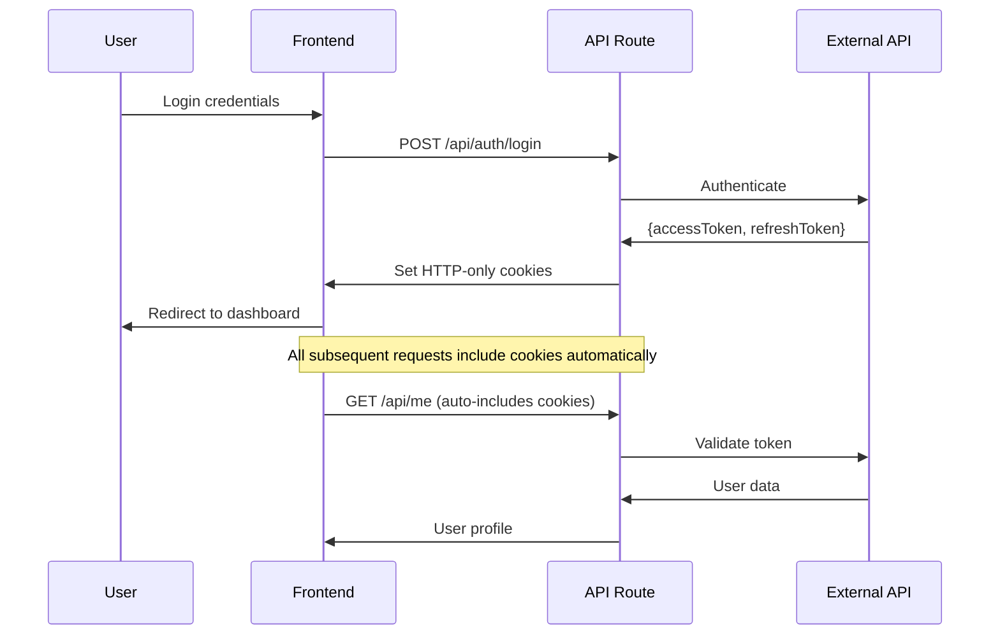

# 🔐 Next.js 15 Secure Token Storage & Authentication

A comprehensive implementation of secure authentication and token management in Next.js 15, demonstrating best practices for frontend security without external libraries.

## 📚 Learning Objectives

This repository teaches you how to implement:

-   **Secure Token Storage** using HTTP-only cookies
-   **Authentication Context** with React Context API
-   **Route Protection** with Next.js middleware
-   **Token Refresh** mechanisms
-   **Security Headers** implementation
-   **Input Validation** and sanitization
-   **Error Handling** best practices

## 🏗️ Architecture Overview

```
┌─────────────────┐    ┌─────────────────┐    ┌─────────────────┐
│   Frontend      │    │   Next.js API   │    │   External API  │
│   (React)       │◄──►│   Routes        │◄──►│   (DummyJSON)   │
└─────────────────┘    └─────────────────┘    └─────────────────┘
         │                       │
         ▼                       ▼
┌─────────────────┐    ┌─────────────────┐
│   Auth Context  │    │   Middleware    │
│   (Global State)│    │   (Protection)  │
└─────────────────┘    └─────────────────┘
```

## 🔑 Security Concepts Explained

### 1. **HTTP-Only Cookies vs Local Storage**

#### ❌ **Why NOT Local Storage?**

```javascript
// ❌ VULNERABLE - Accessible to JavaScript
localStorage.setItem("token", accessToken); // XSS vulnerable
const token = localStorage.getItem("token"); // Can be stolen
```

#### ✅ **Why HTTP-Only Cookies?**

```javascript
// ✅ SECURE - Not accessible to JavaScript
cookies().set("session_token", accessToken, {
    httpOnly: true, // Prevents XSS access
    secure: true, // HTTPS only
    sameSite: "lax", // CSRF protection
    maxAge: 60 * 30, // 30 minutes
});
```

### 2. **Token Storage Strategy**

```typescript
// Two-token system for enhanced security
const tokenStrategy = {
    accessToken: {
        purpose: "API authentication",
        storage: "HTTP-only cookie",
        lifetime: "30 minutes",
        security: "High (auto-expires)",
    },
    refreshToken: {
        purpose: "Renew access tokens",
        storage: "HTTP-only cookie",
        lifetime: "7 days",
        security: "Very High (rotation)",
    },
};
```

### 3. **Authentication Flow**



## 📁 Project Structure

```
src/
├── middleware.ts                 # Route protection & security headers
├── app/
│   ├── page.tsx                 # Auto-redirect based on auth state
│   ├── login/
│   │   └── page.tsx            # Login form with validation
│   ├── dashboard/
│   │   ├── page.tsx            # Protected dashboard
│   │   └── edit-profile/
│   │       └── page.tsx        # Profile editing
│   └── api/
│       ├── auth/
│       │   ├── login/
│       │   │   └── route.ts    # Authentication endpoint
│       │   ├── logout/
│       │   │   └── route.ts    # Session cleanup
│       │   └── refresh/
│       │       └── route.ts    # Token refresh
│       └── me/
│           ├── route.ts        # Get user profile
│           └── update/
│               └── route.ts    # Update user profile
├── contexts/
│   └── AuthContext.tsx         # Global authentication state
└── components/
    └── Providers.tsx           # Context providers wrapper
```

## 🛡️ Security Features

### 1. **Middleware Protection**

```typescript
// src/middleware.ts
export function middleware(request: NextRequest) {
    const token = request.cookies.get("session_token");

    // Security headers for all responses
    response.headers.set("X-Frame-Options", "DENY");
    response.headers.set("X-Content-Type-Options", "nosniff");

    // Route protection
    if (isProtectedRoute && !token) {
        return NextResponse.redirect(new URL("/login", request.url));
    }
}
```

### 2. **Automatic Token Cleanup**

```typescript
// When token expires, automatically clear cookies
if (res.status === 401) {
    const response = NextResponse.json({ message: "Token expired" });
    response.cookies.set("session_token", "", { maxAge: -1 });
    response.cookies.set("refresh_token", "", { maxAge: -1 });
    return response;
}
```

### 3. **Input Validation**

```typescript
// Validate all inputs before processing
if (!username.trim() || !password) {
    return NextResponse.json(
        { message: "Username and password are required" },
        { status: 400 }
    );
}
```

## 🚀 Getting Started

### Prerequisites

-   Node.js 18+
-   npm/pnpm/yarn

### Installation

```bash
# Clone the repository
git clone <repository-url>
cd nextjs-safety-token-store

# Install dependencies
npm install

# Start development server
npm run dev
```

### Test Credentials

For demonstration purposes, use these test credentials:

```
Username: emilys
Password: emilyspass
```

## 🔍 Key Learning Points

### 1. **Cookie Security Configuration**

```typescript
const cookieOptions = {
    httpOnly: true, // Prevents XSS attacks
    secure: process.env.NODE_ENV === "production", // HTTPS only in production
    path: "/", // Available site-wide
    sameSite: "lax" as const, // CSRF protection
    maxAge: 60 * 30, // 30 minutes expiration
};
```

### 2. **Context-Based State Management**

```typescript
// Global authentication state without external libraries
const AuthContext = createContext<IAuthContext | undefined>(undefined);

export function useAuth() {
    const context = useContext(AuthContext);
    if (!context) {
        throw new Error("useAuth must be used within an AuthProvider");
    }
    return context;
}
```

### 3. **Error Handling Strategy**

```typescript
// Consistent error handling across the application
try {
    const response = await fetch("/api/me");
    if (!response.ok) {
        if (response.status === 401) {
            // Handle authentication errors
            router.push("/login");
        }
        throw new Error(await response.text());
    }
} catch (error) {
    console.error("Request failed:", error);
    setError("An unexpected error occurred");
}
```

## 🎯 Best Practices Demonstrated

### 1. **Security First**

-   HTTP-only cookies for token storage
-   Comprehensive security headers
-   Input validation and sanitization
-   Automatic token cleanup on expiration

### 2. **User Experience**

-   Loading states for all async operations
-   Clear error messages
-   Proper form validation
-   Responsive design

### 3. **Code Quality**

-   TypeScript for type safety
-   Consistent error handling
-   Modular component structure
-   Clean separation of concerns

### 4. **Performance**

-   Efficient state management
-   Minimal re-renders
-   Proper cleanup on unmount
-   Optimized API calls

## 🔒 Security Checklist

-   ✅ Tokens stored in HTTP-only cookies
-   ✅ CSRF protection with SameSite cookies
-   ✅ XSS prevention (no JavaScript access to tokens)
-   ✅ Automatic token expiration
-   ✅ Secure headers implementation
-   ✅ Input validation and sanitization
-   ✅ Error handling without information leakage
-   ✅ Route protection with middleware
-   ✅ Automatic logout on token expiration

## 📖 API Endpoints

| Method | Endpoint            | Description         | Protection |
| ------ | ------------------- | ------------------- | ---------- |
| `POST` | `/api/auth/login`   | User authentication | Public     |
| `POST` | `/api/auth/logout`  | Session cleanup     | Protected  |
| `POST` | `/api/auth/refresh` | Token refresh       | Protected  |
| `GET`  | `/api/me`           | Get user profile    | Protected  |
| `PUT`  | `/api/me/update`    | Update user profile | Protected  |

## 🤝 Contributing

This is an educational project. Feel free to:

1. Fork the repository
2. Create a feature branch
3. Add improvements or fix issues
4. Submit a pull request

## 📝 Learning Resources

-   [Next.js Documentation](https://nextjs.org/docs)
-   [HTTP Cookies Security](https://developer.mozilla.org/en-US/docs/Web/HTTP/Cookies)
-   [Web Security Best Practices](https://owasp.org/www-project-top-ten/)
-   [React Context API](https://react.dev/reference/react/createContext)

## ⚖️ License

This project is for educational purposes. Feel free to use it as a learning resource.

---

**🎓 Perfect for learning:** Frontend security, authentication flows, Next.js best practices, and secure token management without external dependencies.
